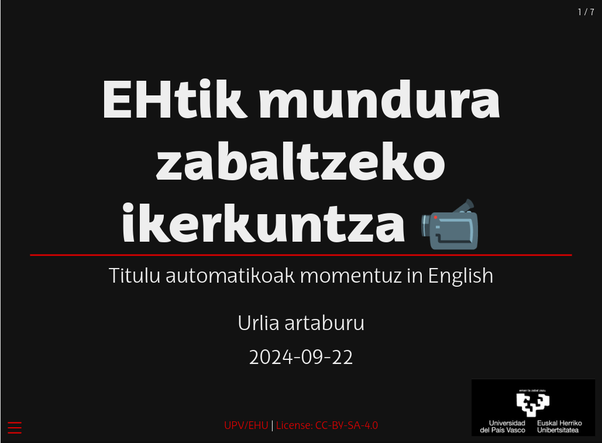

# Quarto Reveal.js template - EHU

<!-- badges: start -->
[](LICENSE)
<!-- badges: end -->

UPV/EHU unibertsitateko [tipografiaz](https://www.ehu.eus/eu/web/gizartea/ehu-tipografia) egiten ditu diapositibak. Eskuma-beheko bazterrean unibertsitateko [logoa](https://www.ehu.eus/eu/web/gizartea/upv-ehuren-logo-orokorrak) ere badu. --  UPV/EHU (University of Baskland) creates slides with [its own typography](https://www.ehu.eus/eu/web/gizartea/ehu-tipografia). The university logo is also present in the bottom right corner.


Aldatu behar izatera, logo-ehu.jpg fitxategia ordezkatu edota `_extensions/ehu/_extension.yml` fitxategian `logo` aldagaian norberarena ipini eta karpeta berean kokatu.

Fitxategian bertan ere alda litezke beheko testu eta estekak.

This is a repository for `Quarto` `revealjs` template.

[]()

## Instalatzea - Installation

Hau da [Quarto](quarto.org) gehigarria, hurrengo komandoa erabiliz instalatu/erabili daitekeena:

This [Quarto](quarto.org) extension can be installed/used using the following command:


- Instalatu - install
  ```bash
  quarto add juanabasolo/ehu-revealjs
  ```
- Erabili - use
  ```bash
  quarto use template juanabasolo/ehu-revealjs
  ```

---

# Diapositiben aurkezpen eleanitz paraleloa

Revealjs eta Multiplex erabilita egin dira. Modurik eleganteena ez bada ere, badabil.

Iturriak:

+ https://quarto.org/docs/presentations/revealjs/presenting.html#multiplex
+ https://github.com/reveal/multiplex/issues/40

Beharrezkoak:

+ Diapositibek egitura bera behar dute
+ YAML buruan multiplex deituta egon behar da
  + `ID` bat behar dute
  + `Secret` bat behar dute
  + Diapo bakoitzerako sortzen dira diapositiba umeak eta guraso (speaker). Diapositiba nagusiena izan ezik, besteak jaurti behar/ahal dira.

## Diapoak

**Nagusiak**, agintzen dutenak:  
<iframe width="800" height="400" marginheight="0" marginwidth="0" src="https://juanabasolo.github.io/ehu-revealjs/0-nausija-speaker.html">
  Ez da ikusten? :_( 
</iframe>

<iframe width="350" height="200" marginheight="0" marginwidth="0" src="https://juanabasolo.github.io/ehu-revealjs/1-a_erderaz.html">
  Ez da ikusten? :_( 
</iframe> <iframe width="350" height="200" marginheight="0" marginwidth="0" src="https://juanabasolo.github.io/ehu-revealjs/1-hamengo_euskeri.html">
  Ez da ikusten? :_( 
</iframe>

<iframe width="350" height="200" marginheight="0" marginwidth="0" src="https://juanabasolo.github.io/ehu-revealjs/1-lunfa.html">
  Ez da ikusten? :_( 
</iframe> <iframe width="350" height="200" marginheight="0" marginwidth="0" src="https://juanabasolo.github.io/ehu-revealjs/1-tano_nahi.html">
  Ez da ikusten? :_( 
</iframe>

### Estekak

+ Nagusiak  
  Hemendik agintzen zaie besteei:  
  https://juanabasolo.github.io/ehu-revealjs/0-nausija-speaker.html

+ Ahuntzerderaz  
  https://juanabasolo.github.io/ehu-revealjs/1-a_erderaz.html

+ Euskera normalaua  
  https://juanabasolo.github.io/ehu-revealjs/1-hamengo_euskeri.html

+ Lunfa  
  https://juanabasolo.github.io/ehu-revealjs/1-lunfa.html

+ Italiora  
  https://juanabasolo.github.io/ehu-revealjs/1-tano_nahi.html